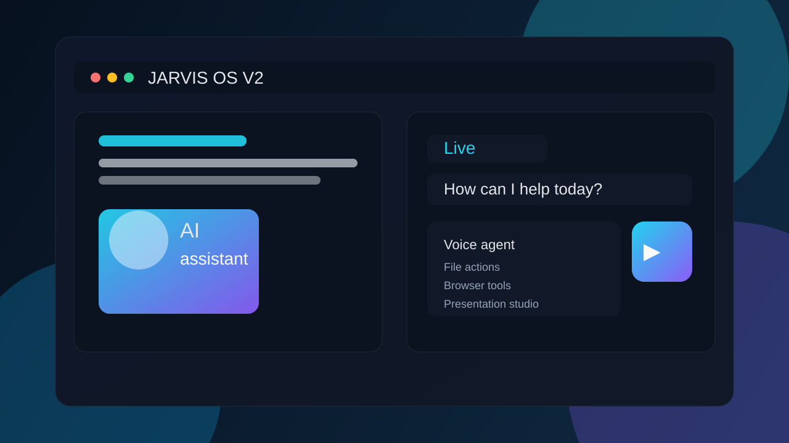
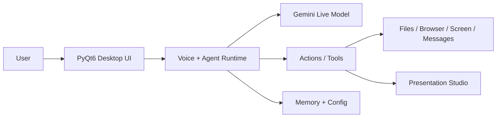

# JARVIS OS V2


JARVIS OS V2 is a Python desktop assistant with a PyQt6 interface, Gemini Live conversational workflow, local file and browser integrations, and a presentation studio for building editable PowerPoint decks.

It is designed to act as a local AI assistant for research, automation, file work, screen understanding, and computer control across supported desktop environments.

## Screenshot



## How it works



## Feature grid

| Capability | Description |
| --- | --- |
| Voice assistant | Real-time conversational AI via Gemini Live |
| Desktop control | Launch apps, automate work, manage local files |
| Research & browsing | Search, summarize, and inspect pages and documents |
| Screen intelligence | Read and interpret content from the local desktop |
| Presentation builder | Generate editable .pptx decks from documents and media |
| Web app support | Local or hosted FastAPI + Next.js architecture |
| Safety checks | Self-test workflows and local validation for deployment |

## Requirements

- Python 3.11 or newer
- Git
- A valid Gemini API key

Check your Python version:

```bash
python --version
```

## Quick start

Clone the repository:

```bash
git clone https://github.com/etienneishimwe01-png/JARVIS-OS-V.2.git
cd JARVIS-OS-V.2
```

Create a virtual environment and install dependencies:

```bash
python -m venv .venv
.venv\Scripts\activate
python -m pip install --upgrade pip
python -m pip install -r requirements.txt
```

On macOS or Linux, use:

```bash
python -m venv .venv
source .venv/bin/activate
python -m pip install --upgrade pip
python -m pip install -r requirements.txt
```

Set up your local config and API key:

- Copy the example environment file if needed
- Add your Gemini API key in your local config or environment
- Do not commit secret values to Git

Then launch:

```bash
python main.py
```

Or use the CLI launcher after setup:

```bash
jarvis
```

## Local configuration and secrets

This repository intentionally ignores local secrets and generated runtime files. Confirm that files such as these stay out of version control:

- .env
- config/api_keys.json
- config/ui_settings.json
- config/layout_settings.json
- memory/long_term.json
- memory/task_history.json

## Project structure

- main.py — startup entry point
- ui.py — desktop interface
- actions/ — app capabilities and integrations
- agent/ — task routing and execution logic
- api/ — backend FastAPI service
- web/ — Next.js frontend
- memory/ — local memory/config storage
- docs/ — usage and QA documentation
- tests/ — automated checks

## Documentation

- [docs/USAGE.md](docs/USAGE.md)
- [docs/TUTORIAL.md](docs/TUTORIAL.md)
- [docs/QA.md](docs/QA.md)
- [CONTRIBUTING.md](CONTRIBUTING.md)

## Safety and publishing checklist

- Keep API keys and local config files out of Git
- Review .gitignore before every release
- Use the self-test workflow before packaging or publishing
- Never commit generated logs, session caches, or local secrets

## License

This project is licensed under the MIT License. See [LICENSE](LICENSE).
